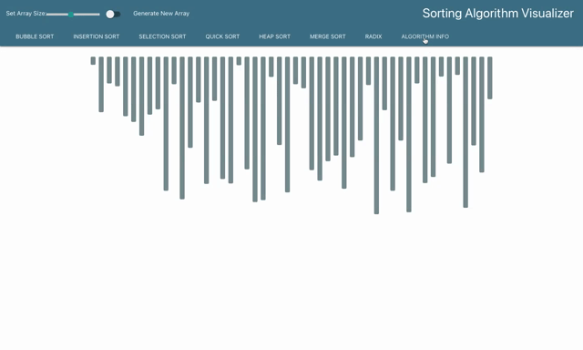

# Sorting Algorithm Visualizer

## Table of Contents
* [Contributors](#contributors)
* [Installation](#installation)
* [Summary](#summary)
  * [Setting Up the Sort](#setting-up-the-sort) 
  * [Sort!](#sort!)
  * [Example Algorithms](#example-algorithms)
  * [Info Page](#info-page)


## Contributors
<a href="https://github.com/dyson1602" >Christopher Michael Clark</a>   &   <a href="https://github.com/mkoenke" >Mary Koenke</a>

## Installation
If you wish to install on your local machine, first fork and clone the repo.
After you have completed cloning, simply run the following `npm` commands to get
it running on a local server:

npm
```
$ cd <app's main directory>
$ npm install
$ npm start
```

## Summary

### Setting Up the Sort


When the user first lands on Sorting Algorithm Visualizer they are met with a 
series of options. There is a ***sliding bar*** that allows the user to change the
amount of elements in the array. The ***toggle*** next to the slide changes the visual
style from a ***bar-style*** to a ***gradient style***. The bar length and gradient shade
are randomly generated every time the user changes the array size or clicks
`Generate New Array`.
<br/>

### Sort!


The user can then select a sorting algorithm method from the choices in the tool bar.
Once a selection has been made a `Sort!` button will appear next to the `Generate New Array`
button. Upon clicking it the algorithm will begin to go to work. During this time
all other options are muted except for the ***style toggle***, the Algorithm Info link,
and the <a href="https://mkoenke.github.io/pathfinding-visualizer/">Pathfinding Algorithm</a> link.
<br/>

### Example Algorithms
#### Merge Sort


#### Radix Sort


### Info Page


When the user clicks ***Algorithm Info*** they are directed to a separate page.
This page has a series of cards that the user can click on to display information
about each algorithm. The information includes time complexity, space complexity, and psuedocode desciptions as to how the algorithm functions.


